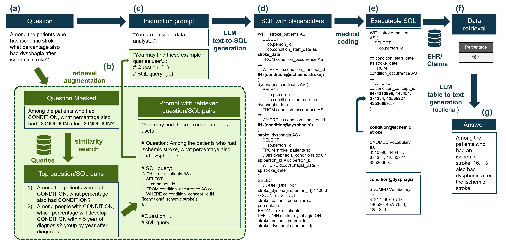
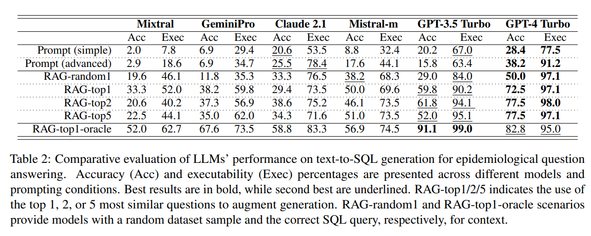

## Retrieval augmented text-to-SQL generation for epidemiological question answering using electronic health records

This repository contains the code of the following paper:

Please find the Preprint here: Ziletti and D'Ambrosi, https://arxiv.org/abs/2403.09226    
This paper is accepted at NAACL 2024 Clinical NLP Workshop (https://clinical-nlp.github.io/2024/)   

Here is a summary workflow of the procedure:

and here are the main results:


Please refer to the manuscript for more details: https://arxiv.org/abs/2403.09226

## Query Library
The labelled question-SQL pairs are in the file `text2sql_epi_dataset_omop.xlsx` in the `dataset` folder.


## Installation
We used Python 3.11 in our experiments.  

Install latest version from the master branch on GitHub by:
```
git clone <GITHUB-URL>
cd text-to-sql-epi-ehr-naacl2024
pip install -r requirements.txt
```

## Instructions
### Query library compilation
First, we need to create a Pickle file (the query library) from the Excel file provided in the `dataset` folder
```
cd scripts
python run_querylib_calc.py 
```
This Pickle file will be then used to perform the retrieval augmented generation (RAG) at the query generation stage.

### SQL query generation
To perform a prediction, run the script `prediction_pipeline.py` with your question in double quotes. For example,
```
cd scripts
python prediction_pipeline.py --question "How many women with atopic dermatitis?"
```

This should return:
```
Question: How many women with atopic dermatitis?

SQL template:
 SELECT COUNT(DISTINCT p.person_id) AS female_patients_with_atopic_dermatitis
FROM condition_occurrence AS co
JOIN person AS p ON co.person_id = p.person_id
WHERE co.condition_concept_id IN ([condition@atopic dermatitis])
AND p.gender_concept_id = 8532;
```

### SQL query execution
To execute the query, you will 
Here is a link to the dataset on Google Cloud: https://console.cloud.google.com/marketplace/product/hhs/synpuf
You can then open the link (will need a Google account), and run the query in your Google Account.

To make the query executable on Google BigQuery, you will need to modify the generated names of the table to comply with the Google Query Table Names.
This is simply a renaming of the Tables.

For example,

```
SELECT COUNT(DISTINCT p.person_id) AS female_patients_with_atopic_dermatitis
FROM person AS p
JOIN condition_occurrence AS co ON p.person_id = co.person_id
JOIN concept AS c ON co.condition_concept_id = c.concept_id
WHERE p.gender_concept_id = 8532
AND c.concept_id IN (133834,4298597,4066382,4298599,4296193,4080929,4296192,4290738,4290734,4206125,4290736,4080928,4033671,4031630,4297478,4296190,4031631,4080927,4298598,4298601,4031013,4297362,4290740,4297495,40482226,4298600,4236759);
```

must be changed to
```
SELECT 
  COUNT(DISTINCT p.person_id) AS female_patients_with_atopic_dermatitis
FROM `bigquery-public-data.cms_synthetic_patient_data_omop.person` AS p
JOIN `bigquery-public-data.cms_synthetic_patient_data_omop.condition_occurrence` AS co ON p.person_id = co.person_id
JOIN `bigquery-public-data.cms_synthetic_patient_data_omop.concept` AS c ON co.condition_concept_id = c.concept_id
WHERE p.gender_concept_id = 8532
AND c.concept_id IN (133834,4298597,4066382,4298599,4296193,4080929,4296192,4290738,4290734,4206125,4290736,4080928,4033671,4031630,4297478,4296190,4031631,4080927,4298598,4298601,4031013,4297362,4290740,4297495,40482226,4298600,4236759);
```
to run on the BigQuery instance above.

If you have your own Snowflake Data Warehouse, you might not need to perform those changes.

### [Optional] Medical coding compilation
In the repository, we provide a mockup version for medical coding to show how medical coding can be integrated in the process, as shown in the figure above.
The coding is performed within the SNOMED ontology, since that is the underlying ontology for data stored in the OMOP common data model (OMOP-CDM).
The table is usually called CONCEPT_TABLE in the OMOP-CDM.

We prepared a small mockup table in the `dataset` folder called `medcodes_mockup.xlsx`. Here we provide synthetic data following the data structure of the OMOP-CDM.
You can download the whole ontology from the National Library of Medicine [here](https://www.nlm.nih.gov/healthit/snomedct/archive.html).
(Please note that you need to accept their terms and conditions)

More information on SNOMED-CT can be found for example [here](https://www.bfarm.de/EN/Code-systems/Terminologies/SNOMED-CT/_node.html)

First, we need to create a Pickle file (the medcodeonto library) from the Excel file provided 
```
cd scripts
python run_medcoding_calc.py
```
This Pickle file will be then used to search for medical codes within the pickle file. Running the file will also provide an example of how coding is performed.

